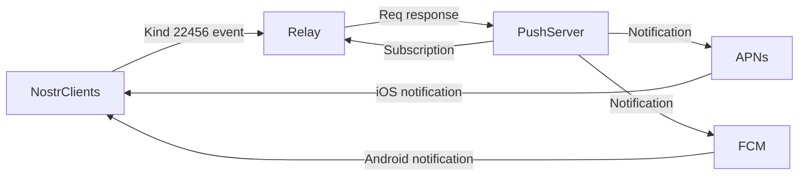

# 0xChat-Core

Welcome to the 0xChat-Core Repository. This repository houses the core code of 0xChat App, dealing with all data requests and local data storage. With this repository at your disposal, you can effortlessly build your own user interface, without the need to manage any underlying logic.

0xchat Download links:

  - [0xchat on iOS](https://apps.apple.com/app/0xchat/id1637607169)
  - [0xchat on Android](https://play.google.com/store/apps/details?id=com.oxchat.nostr)


## Language & Platforms
The repository is primarily implemented in Dart, allowing you to swiftly create versions for iOS, Android, and Desktop.

## Getting Started
You can start by cloning this repository to your local machine using the command:

```git
git clone https://github.com/0xChat/0xChat-Core.git
```

## Modules
At present, the repository supports the following modules and functionalities:

1. **Account Module**: This module handles all account-related operations. It allows for account creation, user data requests, and caching of user information, among other features.

2. **Chat Module**: The chat module offers encrypted private chatting, encrypted contact lists, and open channels.
3. **Common Module**: The Common Module provides database integration and establishes connections with relay services.

## Features

1. [Secured Private Messages](https://github.com/0xchat-app/0xchat-core/blob/main/doc/friends.md)


	0xchat has optimized private messaging based on NIP04 to prevent leakage of users' real public keys (pubkeys) during private chats. This is achieved by implementing the [NIP101](https://github.com/water783/nips/blob/nip101/101.md) protocol, which creates an alias for users during private conversations.


2. [Push Notifications](https://github.com/0xchat-app/0xchat-core/blob/main/doc/nofitications.md)

	0xchat proposes a method for message push notifications, includes the sending and processing of heartbeat signals to detect online status and provide timely push notifications.
	


## Nips Supported
- [x] [NIP 01 Basic protocol flow description](https://github.com/nostr-protocol/nips/blob/master/01.md)
- [x] [NIP 02 Contact List and Petnames](https://github.com/nostr-protocol/nips/blob/master/02.md)
- [x] [NIP 04 Encrypted Direct Message](https://github.com/nostr-protocol/nips/blob/master/04.md)
- [x] [NIP 05 Mapping Nostr keys to DNS-based internet identifiers](https://github.com/nostr-protocol/nips/blob/master/05.md)
- [x] [NIP 09 Event Deletion](https://github.com/nostr-protocol/nips/blob/master/09.md)
- [x] [NIP 10 On "e" and "p" tags in Text Events (kind 1)](https://github.com/nostr-protocol/nips/blob/master/10.md)
- [x] [NIP 15 End of Stored Events Notice](https://github.com/nostr-protocol/nips/blob/master/15.md)
- [x] [NIP 19 bech32-encoded entities](https://github.com/nostr-protocol/nips/blob/master/19.md)
- [x] [NIP 20 Command Results](https://github.com/nostr-protocol/nips/blob/master/20.md)
- [x] [NIP 21 nostr: URI scheme](https://github.com/nostr-protocol/nips/blob/master/21.md)
- [x] [NIP 28 Public Chat](https://github.com/nostr-protocol/nips/blob/master/28.md)
- [x] [NIP 33 Parameterized Replaceable Events](https://github.com/nostr-protocol/nips/blob/master/33.md)
- [x] [NIP 51 Lists](https://github.com/nostr-protocol/nips/blob/master/51.md)
- [x] [NIP 57 Lightning Zaps](https://github.com/nostr-protocol/nips/blob/master/57.md)
- [x] [NIP 58 Badges](https://github.com/nostr-protocol/nips/blob/master/58.md)


### Nips for 0xchat
- [x] [NIP 101 Alias Key Exchange](https://github.com/water783/nips/blob/nip101/101.md)
- [x] [NIP XXX Push Notifications](https://github.com/0xchat-app/0xchat-core/blob/main/doc/nofitications.md)
- [x] [NIP 100 WebRTC](https://github.com/jacany/nips/blob/webrtc/100.md)


## Future Enhancements
We continuously aim to improve and enhance the features provided by this repository. Stay tuned for future updates!

Some important planned features:

- [ ] Threads, mentions, reactions
- [ ] Zap Red Envelopes between friends
- [ ] P2P audio/video calling
- [ ] Private group
- [ ] Audio/video chat room
- [ ] Lightning wallet Integration

## Support

We encourage contributions from the developer community! To contribute, please fork this repository, make your changes, and submit a pull request. 
If you encounter any issues or have questions, feel free to open an issue in this repository.

For more details and updates, please visit the official [0xChat website](https://www.0xchat.com).