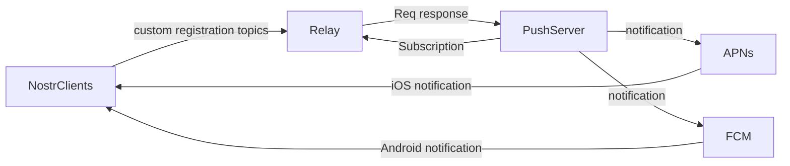

# NIP: XXX - Push Notifiation 

## Abstract

This NIP proposes a method for message push notifications using the NIP protocol.

## Motivation

The process includes the sending and processing of heartbeat signals to detect online status and provide timely push notifications.

##Architecture




## Specification

Push settings:

```json
{
"kind": 22456,
 "tags": [
    ["p", "push server pubkey"],
  ],
 "content": "<encrypted_text>?iv=<initialization_vector>"
}
```
The 'content' is encrypted using the NIP04 protocol. The decrypted content is as follows:

```json
{
    "online": 1,
    "kinds": "<kind list you want to push>",
    "deviceId": "<device token>",
    "relays": "<relays you want the push server to listen>",
    "#e": "<channels list want to listen>",
    "#p": "<friend's alias pubkeys>"
}

```
The push server receives the message with 'kind' 22456 and sends it to its own server. It decrypts the 'content', obtains the contents to be pushed (kinds, #e, #p), and listens to the specified 'relays'. It then pushes notifications to the device with the specified 'deviceId' using APNs, FCM services.

The heartbeat is as follows:

```json
{
    "online": 1
}

```
The heartbeat is sent every minute. If there is no heartbeat after a timeout, the device is considered offline. The push server will then start the push service.

##Rationale
This method makes full use of the NIP protocol to implement a push notification mechanism. By using the encrypted content in NIP04, it ensures the privacy and security of the user's data.

The use of heartbeat detection can timely and accurately determine the online status of the device, and it can provide efficient and accurate push notification services.


##Implementation
[https://github.com/0xchat-app/0xchat-core/blob/main/lib/src/account/notification.dart](https://github.com/0xchat-app/0xchat-core/blob/main/lib/src/account/notification.dart)


