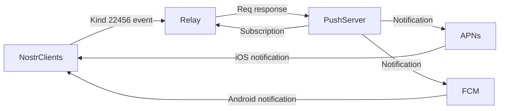

# NIP: XXX - Push Notifiation 

## Abstract

This NIP proposes a method for message push notifications using the NIP protocol, includes the sending and processing of heartbeat signals to detect online status and provide timely push notifications.


## Architecture




## Specification

### Push settings:

```json
{
"kind": 22456,
 "tags": [
   	["p", "push server pubkey"],
  ],
 "content": "<encrypted_text>?iv=<initialization_vector>"
}
```
The 'content' is encrypted using the NIP04 protocol. The decrypted content is as follows:

```json
{
    "online": 1,
    "kinds": "<list of event kinds to be notified about>",
    "deviceId": "<device token>",
    "relays": "<list of relays for the push server to subscribe to>",
    "#e": "<list of groups to be notified about>",
}

```
Upon receiving the encrypted message of 'kind' 22456, the push server decrypts it to obtain the subscription information (kinds, #e, #p) and the specified 'relays' to listen to. It then sends notifications to the device identified by the 'deviceId', using both APNs and FCM services.

### Heartbeat:

```json
{
    "online": 1
}

```
The heartbeat is sent at regular intervals, with the duration determined by the push service. If there is no heartbeat after a timeout, the device is considered offline. The push server will then start the push service.

### Offline

```json
{
    "online": 0
}

```
When a device needs to go offline immediately, set 'online' to 0 and the push server will promptly initiate message push. 

Note: If 'online' is not set to 0, but the heartbeat timeout has occurred, it will also be treated as an offline state.


### Logout

```json
{
    "online": 0,
    "deviceId": ""
}

```

When a user logs out, there is no longer a need to receive push notifications, so the 'deviceId' should be set to an empty string.

## Rationale
This method makes full use of the NIP protocol to implement a push notification mechanism. By using the encrypted content in NIP04, it ensures the privacy and security of the user's data.

The use of heartbeat detection can promptly and accurately determine the online status of the device, providing efficient and accurate push notification services


## Implementation
[https://github.com/0xchat-app/0xchat-core/blob/main/lib/src/account/notification.dart](https://github.com/0xchat-app/0xchat-core/blob/main/lib/src/account/notification.dart)


